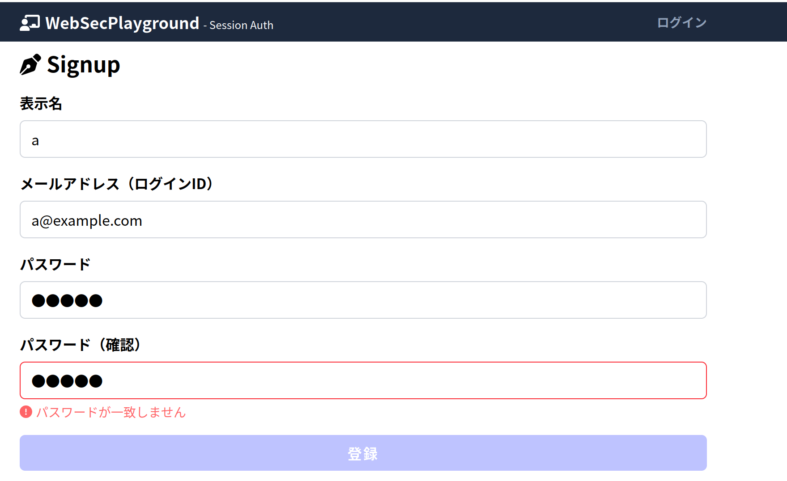
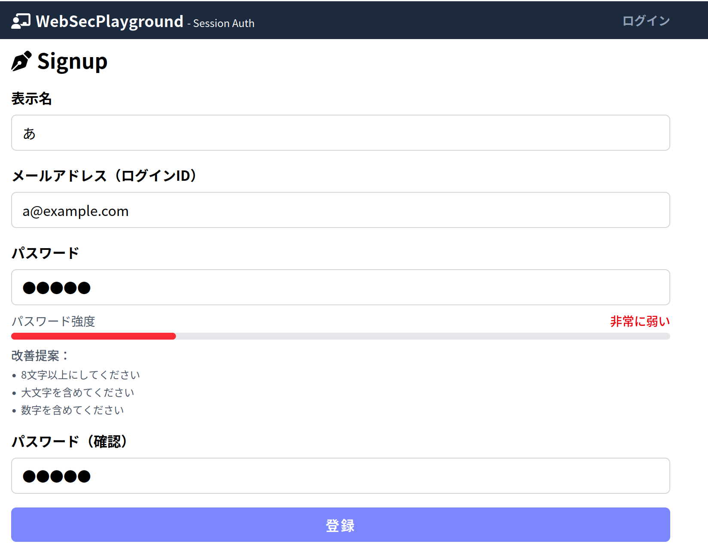
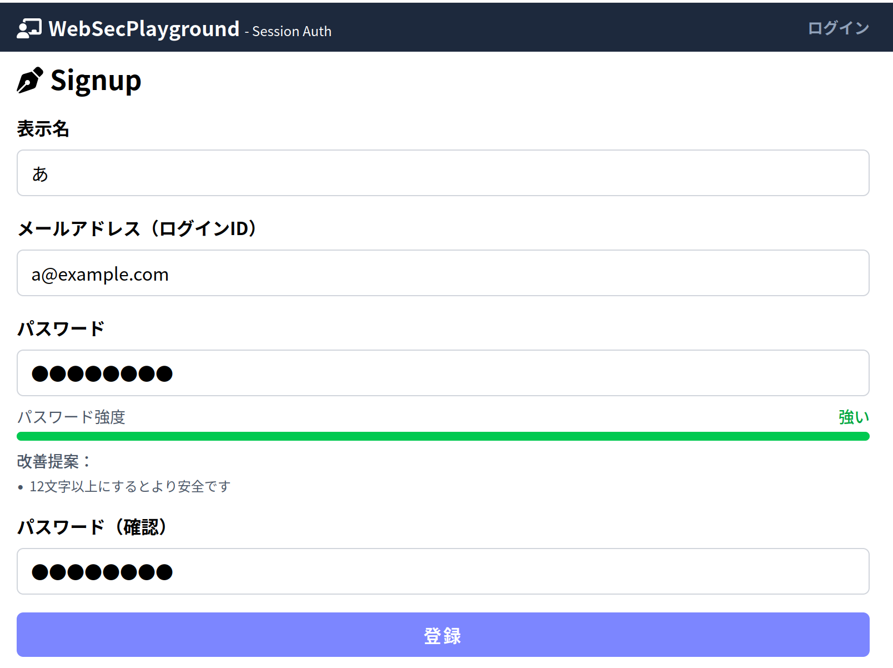

# 実装課題2

## サインアップのときに確認用パスワードを要求するようなUI機能
### 変更を加えた主な箇所
- [src/app/signup/page.tsx](./src/app/signup/page.tsx)
- [src/app/_types/SignupRequest.ts](./src/app/_types/SignupRequest.ts)

### 画像

## サインアップのときにパスワード強度を表示するような機能
### 変更を加えた主な箇所
- [src/app/signup/page.tsx](./src/app/signup/page.tsx)
- [src/app/_utils/passwordStrength.ts](./src/app/_utils/passwordStrength.ts)
- [src/app/_components/PasswordStrengthIndicator.tsx](./src/app/_components/PasswordStrengthIndicator.tsx)

### 画像

